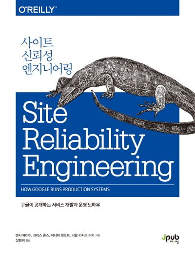
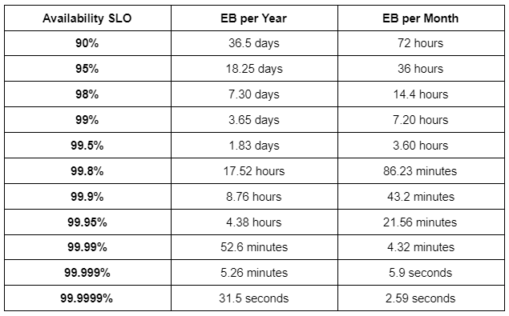

# 
# Chapter 1 - Introduction

## 📌 Summary
시스템의 복잡도와 트래픽이 증가할수록 **서비스 관리의 어려움**이 커지며, 운영팀과 개발팀 간의 **상이한 목표**로 인해 갈등이 자주 발생한다.

Google은 이를 해결하기 위해 **운영을 코드로 해결하는 엔지니어링 접근법**을 도입했고, 이를 **SRE(Site Reliability Engineering)** 라고 명명했다. SRE의 도입으로 인해 제품 개발팀과 SRE팀 간의 **손쉬운 업무 전환**이 가능해져, 개발팀과 운영팀의 분리에서 발생하는 **갈등이 완화**되었다.

또한, SRE팀은 **반복적인 운영 작업을 자동화**하고 혁신적인 운영 방식으로 전환하는 역할을 수행한다.

SRE팀은 개발팀의 목표인 **빠른 개발 속도**와 운영팀의 목표인 **서비스 안정성** 사이의 **균형**을 맞추기 위해 **SLO(Service Level Objectives)** 를 설정하며, 이를 기준으로 **에러 예산(Error Budget)** 을 계산한다.

예를 들어, 아래와 같이 SLO와 에러 예산이 설정되었다고 가정해보자.

- 가용 가능한 **SLO**를 **95%**로 설정하면, **에러 예산**은 **5%**
- 한 달 기준으로 보면 **최대 36시간의 다운타임 허용**

에러 예산을 활용하면 **서비스 신뢰성을 유지하면서도 혁신적인 기능을 빠르게 출시**할 수 있다. 즉, 다운타임을 예측 가능한 상황으로 만들어 **SRE의 통제 하에서 운영**되도록 하는 것이다.

Google에서 제시하는 SRE의 핵심 업무는 다음과 같다:

📌 **모니터링 및 긴급 대응** (Monitoring & Incident Response)  
📌 **변화 관리** (Change Management)  
📌 **수요 예측 및 수용 계획** (Capacity Planning)  
📌 **프로비저닝** (Provisioning)  
📌 **성능 최적화** (Performance Optimization)  

---

## ❗ **Difficulties**
**생소한 용어**들이 많아서 이해하고 적용하는 데 어려움을 겪었다. 주요 개념들을 정리해보았다.

📌 **Postmortem**  
- 문제가 발생한 후 **원인을 분석**하고 **재발 방지 대책**을 마련하는 과정
- 프로젝트 종료 후 **검토 회의**를 진행하여 자유롭게 피드백을 공유하는 방식

📌 **SLA (Service Level Agreement)**  
- **고객이 기대할 수 있는 최소 수준의 성능과 가용성**을 정의하는 계약

📌 **SLO (Service Level Objective)**  
- 공급업체가 SLA를 충족하기 위해 설정하는 **내부 목표**

📌 **SLI (Service Level Indicator)**  
- 실제로 SLA 및 SLO를 **얼마나 충족하는지 측정하는 지표**

---

## 🔗 **References**
본 책에서는 SLO, SLA, SLI라는 단어가 직접적으로 언급되지는 않지만, **에러 예산**을 조사하는 과정에서 관련된 개념이라 정리해보았다.
