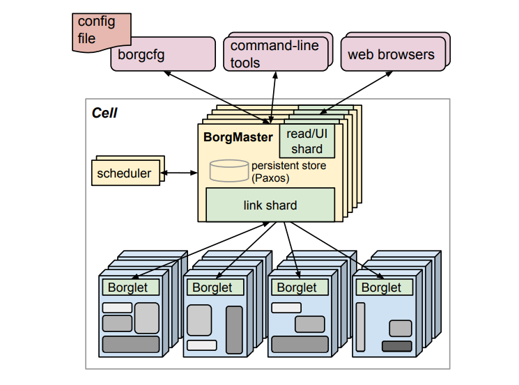
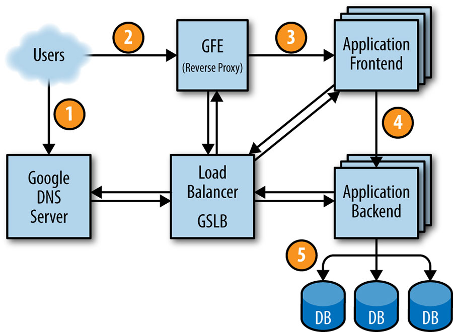

# 
# Chapter 2 - The Production Environment at Google, from the Viewpoint of an SRE  

## 📌 Summary  

Google의 데이터센터 내에는 대규모의 하드웨어 자원이 존재하며, **대규모 분산 시스템**을 기반으로 운영된다. 이러한 자원들은 개별 서버 단위가 아닌 **분산 클러스터 운영 시스템인 Borg(보그)** 를 통해 관리된다.  
# 

Borg는 현재 널리 사용되고 있는 **쿠버네티스(Kubernetes)의 전신**이며, Borg의 태스크(Task)들은 데이터를 **Lustre 및 HDFS** 같은 클러스터 파일 시스템을 활용해 저장한다.  

Google의 서비스들은 Borg 내에서 **Job 단위**로 관리되며,  
전 세계적으로 분포된 서비스 간 **지연 시간을 최소화하기 위해 GSLB(Global Server Load Balancing)를 활용**해 사용자를 가장 가까운 데이터센터로 연결한다.  

본 챕터에서는 사용자의 요청이 Google의 프로덕션 환경에서 어떻게 전달되는지를 예시를 통해 설명한다.  

# 

사용자는 도메인에 접속하여 DNS로부터 IP 주소를 획득하게 되는데, 이때 GSLB를 통해 사용자와 가장 근접한 위치에 있는 서버의 IP 주소가 할당된다. 

사용자의 요청은 GFE를 통해 서비스의 프론트엔드 서버에 전달되며 프론트엔드와 백엔드는 gRPC를 통해 데이터를 주고받는다. 이때, 프론트엔드와 백엔드 역시 GSLB를 통해 연결된다.   

Google의 서비스와 데이터센터는 전 세계적으로 분포되어 있기 때문에, GSLB에 장애가 발생하거나 특정 Task가 트래픽을 감당하지 못하면 서비스 운영이 어려워질 수 있다. 

이를 예방하기 위해 Google은  
- **부하 테스트(Load Testing)**  
- **여러 지역에서의 시범 테스트**  

를 통해 **각 지역에서 필요한 최소한의 Task 수**를 계산하고,  
이를 기반으로 **안정적인 서비스를 제공**한다.  

---

## ❗ Difficulties  

이번 챕터에서는 **Borg에 대한 용어**가 자주 언급되므로,  
아래 표를 통해 핵심 개념을 정리했다.  

| 🏷 **구성 요소**     | 📝 **설명** |
|-----------------|------------------------------------------------------------------------------------------------|
| **BorgMaster**  | Borg 시스템의 중앙 제어 역할을 하며, API 제공, 작업 예약(스케줄링), 클러스터 관리 등을 수행한다. |
| **Scheduler**   | Slave 노드에서 실행할 작업을 결정하고 할당하는 역할. 리소스 가용성과 우선순위에 따라 작업을 배치한다. |
| **Borglet**     | 각 Slave Node에 설치된 **에이전트**로, 컨테이너 관리 및 네트워크 라우팅을 담당한다. |
| **작업(Task)**   | Borg 시스템에서 실행되는 개별 작업 단위. |
| **할당(Alloc)**  | 작업을 실행하기 위해 **Scheduler에 의해 Slave 노드에 할당된 자원**을 의미. |
| **작업 그룹(Job)** | 여러 개의 Task를 그룹화하여 관리하는 단위. |
| **셀(Cell)**    | Borg 시스템에서 클러스터를 관리하는 단위로, 평균적으로 **10,000대의 머신**으로 구성됨. |

---

## 🔗 References  

