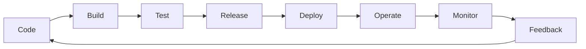

# Chapter 11 - Being On-Call

## On-Call

### DevOps Lifecycle

### Operation

- 운영은 단순히 서비스가 돌고 있는 상태를 유지하는 것이 아니라, 사용자에게 약속한 수준의 신뢰성(SLO)을 보장하기 위해 존재하는 것.
- 운영은 단순 작업이 아니라, 시스템에 대한 책임을 실천하는 방식
- 시스템을 사용하는 사람과 그것을 운영하는 사람 모두와의 관계
- 인간-시스템 사이의 인터페이스

- _**e.g.**_
  - 자동화된 배포/운영만이 아니라, 메뉴얼 기반 또한 여기서 말하는 운영에 포함이 될 수 있다고 생각.
  - 메뉴얼한 부분을 점차 자동화시켜나가고 꾸준히 향상시키는 것이 일반적인 운영팀과 다른 DevOps/SRE의 책임이라고 생각.

### On-Call

- SLO를 보장하기 위해 최소한의 On-Call을 해야만 함.
- 단, SLO가 만족되는 선 내에서 On-Call을 하고 여유시간 내에서 지속적으로 시스템을 향상시킬 수 있도록 해야 함.
- 결과론적으로 보이지만, 구글은 가용가능한 인원이 팀 단위로 존재하기도하고 지금껏 만들어온 모니터링 시스템(함부로 alert하지 않는)을 통해 각 문제에 대한 처리를 적절한 시간 내에 이루어 냄.

## Balanced On-Call

- 핵심은 운영 부하(On-Call로 인해 다른 업무를 못하는 것)를 일으키지 않는 선에서 양과 질을 고려하여 On-Call duty를 수행하자
  - 구글 규모로는 충분히 사이클을 돌릴 수 있는 인원이 존재하기 때문에, 해당 파트는 너무 이상적인 얘기만 하는 것으로 보임.
- 대부분의 조직에서는 Severity 라벨링 정도가 최선이지 않을까

## Attitudes in On-Call

- Intuitive, automatic, and rapid action
- Rational, focused, and deliberate cognitive functions

후자가 엔지니어가 가져야할 이상적인 사고 방식이지만, 현실적인 문제로 전자를 택하는 경우가 많은 것은 맞음.  
하지만 전자를 경계하고 예방을 해야지, 전자를 선택하는 것은 언젠가 터질 문제를 발생시키는 경우가 매우 많은 듯.  
_**e.g.**_ 장애를 해결해야만 해서 즉각 조치를 취하나, 문제 및 임시 조치에 관해서 보고서(postmortem)를 쓰지 않는 경우.

다만 책에서 말하는 것과 같이 이런 사고가 모두에게 보장이 되려면, 절차와 탓하지 않는 문화가 필요한 것 같음.

## Operational Overload

- SLO 및 충분한 인원이 먼저 보장되어야 운영 부하가 일어나지 않는 듯.
- 아무런 기준없이 Toil 및 On-Call duty를 처리하다보면 시스템 향상에 대한 기회를 놓치고, 엔지니어 또한 정신적으로나 육체적으로 소모되는 것 같음
  - 많은 조직에서 DevOps/SRE가 자조적으로 "잡부"라고 말하는 이유?

## A Treacherous Enemy: Operational Underload

- 부하가 없는 것이 시스템에는 좋으나 엔지니어에게 좋지 않으므로 구글은 주기적으로 예방 훈련을 실시
  - 동의는 하나, 테스트 용 환경 구성 등등에 가용 자원이 있어야하지 않을까
  - 어느정도 문화만 따라간다고 하면, postmortem에 연관 브랜치를 모두 명시하고 일시적으로 환경을 reproduce하는 방법이 있을 듯.
